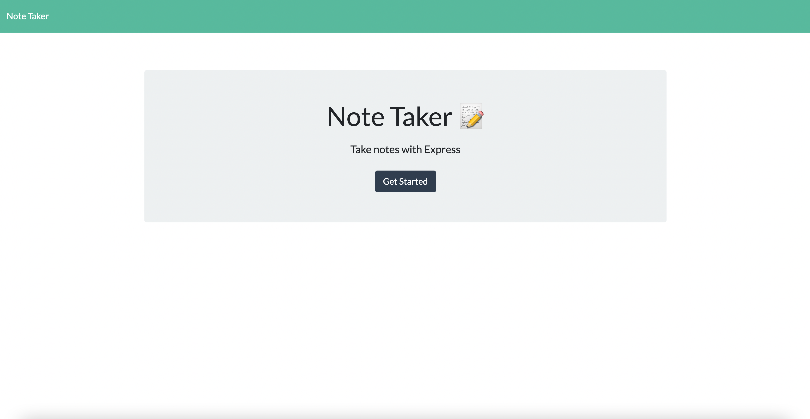
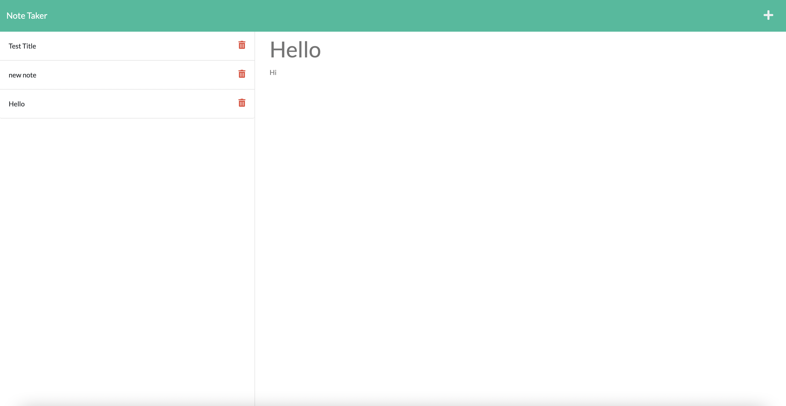

# Note Taker

## Description

Your challenge is to create an application called Note Taker that can be used to write and save notes. This application will use an Express.js back end and will save and retrieve note data from a JSON file.

## Table of Contents

1. [Deployed Page](#deployed-page)
2. [Acceptance Criteria](#acceptance-criteria)
3. [Comments](#comments)
4. [URL of Deployed Application](#url-of-deployed-application)
5. [Credits](#credits)

## Deployed Page

## Acceptance Criteria

GIVEN a note-taking application
WHEN I open the Note Taker
THEN I am presented with a landing page with a link to a notes page
WHEN I click on the link to the notes page
THEN I am presented with a page with existing notes listed in the left-hand column, plus empty fields to enter a new note title and the note’s text in the right-hand column
WHEN I enter a new note title and the note’s text
THEN a Save icon appears in the navigation at the top of the page
WHEN I click on the Save icon
THEN the new note I have entered is saved and appears in the left-hand column with the other existing notes
WHEN I click on an existing note in the list in the left-hand column
THEN that note appears in the right-hand column
WHEN I click on the Write icon in the navigation at the top of the page
THEN I am presented with empty fields to enter a new note title and the note’s text in the right-hand column

## Comments

1. Created routes that allows user to create a new note
2. Save button appears when user enters title and body text
3. Saved notes appear in the left column and can be viewed in the right column when clicked
4. Application has been deployed to Heroku
5. Delete note function has not been completed

## URL of Deployed Application

[Deployed Page URL](https://notetakerapp-nicolev.herokuapp.com/)

## Credits

1. Starter code from [GitHub](https://github.com/coding-boot-camp/miniature-eureka)
2. Article explaining how to deploy to [Heroku](https://dashboard.heroku.com/apps)